# Setting Up OpenChoreo Locally on macOS with k3d and Rancher Desktop

> **A Complete Guide to Running a Full Cloud-Native Application Platform on Your Mac**
>
> ⏱️ **Time Required**: 45-60 minutes
> 📚 **Difficulty**: Intermediate
> 🔗 **Official Docs**: [openchoreo.dev](https://openchoreo.dev/)

---

## 📋 Table of Contents

- [Introduction](#introduction)
- [Understanding the Architecture](#understanding-the-architecture)
- [Prerequisites and Dependencies](#prerequisites-and-dependencies)
- [Installing Required Tools](#installing-required-tools)
- [Creating the k3d Cluster](#creating-the-k3d-cluster)
- [Installing Prerequisites](#installing-prerequisites)
- [Setting Up the Control Plane](#setting-up-the-control-plane)
- [Setting Up the Data Plane](#setting-up-the-data-plane)
- [Verification and Testing](#verification-and-testing)
- [Troubleshooting Common Issues](#troubleshooting-common-issues)
- [What's Next](#whats-next)
- [Complete Automation Script](#complete-automation-script)

---

## 🚀 Introduction

OpenChoreo is a powerful cloud-native application platform built on Kubernetes that simplifies the deployment and management of microservices. While it's designed for production cloud environments, setting it up locally on your Mac is an excellent way to learn the platform, develop features, or contribute to the project.

In this guide, I'll walk you through the complete process of setting up OpenChoreo on macOS using k3d (a lightweight Kubernetes distribution) and Rancher Desktop. By the end, you'll have a fully functional OpenChoreo installation running on your local machine.

### What You'll Build

By following this guide, you'll set up:

- ☁️ **Control Plane**: The brain of OpenChoreo - manages APIs, UI (Backstage), and orchestration
- 📦 **Data Plane**: Where your application workloads actually run
- 🛠️ **Complete toolchain**: All the prerequisites for OpenChoreo development

---

## 🏗️ Understanding the Architecture

OpenChoreo uses a **multi-plane architecture** that separates concerns:

### Architecture Diagram

```mermaid
graph TB
    User((👤 Developer))
    EndUser((🌐 End User))

    subgraph CP["☁️ Control Plane - Port 8080/8443"]
        CP_Gateway["🔀 Gateway"]
        Backstage["🎭 Backstage Console"]
        Thunder["🔐 Thunder (Identity)"]
        API["🔌 OpenChoreo API"]
        Controller["⚙️ Controller Manager"]
        ClusterGateway["🌉 Cluster Gateway"]
    end

    subgraph DP["📦 Data Plane - Port 19080/19443"]
        DP_Gateway["🔀 Gateway"]
        ClusterAgent["🤖 Cluster Agent"]
        Apps["🚀 Your Applications"]
    end

    subgraph BP["🏗️ Build Plane (Optional) - Port 10081/10082"]
        ArgoWorkflows["🔄 Argo Workflows"]
        Registry["📦 Container Registry"]
    end

    subgraph OP["📊 Observability Plane (Optional) - Port 11080-11085"]
        Observer["👁️ Observer API"]
        OpenSearch["🔍 OpenSearch"]
        Prometheus["📈 Prometheus"]
    end

    K8s[("⎈ Kubernetes API Server")]

    User -->|① Access Console| CP_Gateway
    CP_Gateway --> Backstage
    CP_Gateway --> API
    API --> Controller
    Controller -->|② Manages| K8s
    ClusterAgent -->|③ WebSocket| ClusterGateway
    ClusterAgent -->|④ Creates| Apps
    EndUser -->|⑤ Access| DP_Gateway
    DP_Gateway -->|Routes| Apps
    Controller -->|Triggers| ArgoWorkflows
    ArgoWorkflows -->|Pushes| Registry
    Registry -->|Pulls| Apps
    Apps -->|Telemetry| Observer
```



*View this diagram at [mermaid.live](https://mermaid.live/)*

### Why This Matters

- **Separation of concerns**: Control plane doesn't run your apps
- **Security**: Data plane is isolated
- **Scalability**: Can add multiple data planes
- **Local development**: Perfect for testing without cloud costs

---

## 📦 Prerequisites and Dependencies

### Hardware Requirements

- **macOS**: 10.15 (Catalina) or later
- **Architecture**: Apple Silicon (M1/M2/M3) or Intel
- **RAM**: Minimum 8GB, recommended 16GB
- **Disk Space**: At least 20GB free
- **Docker Desktop or Rancher Desktop**: Running and configured

### Knowledge Prerequisites

- Basic understanding of Kubernetes concepts
- Familiarity with command line/terminal
- Basic knowledge of YAML and containers

---

## 🔧 Installing Required Tools

Let's install all the dependencies using **Homebrew**.

### Step 1: Install Homebrew

```bash
/bin/bash -c "$(curl -fsSL https://raw.githubusercontent.com/Homebrew/install/HEAD/install.sh)"
```

### Step 2: Install Docker/Rancher Desktop

**Option A: Rancher Desktop (Recommended)**

1. Download from https://rancherdesktop.io/
2. Install the application
3. Open Rancher Desktop → **Preferences → Container Engine**
4. Select **dockerd (moby)**
5. Apply and restart

**Option B: Docker Desktop**

```bash
brew install --cask docker
```

### Step 3: Install k3d

```bash
brew install k3d
```

Verify:
```bash
k3d version
# Expected: k3d version v5.8.3 or higher
```

### Step 4: Install kubectl

```bash
brew install kubectl
```

Verify:
```bash
kubectl version --client
# Expected: Client Version: v1.31.x or higher
```

### Step 5: Install Helm

```bash
brew install helm
```

Verify:
```bash
helm version --short
# Expected: v3.15.x or higher
```

### Step 6: Install Go

```bash
brew install go
```

Verify:
```bash
go version
# Expected: go version go1.24.0 or higher
```

### Step 7: Verify All Tools

```bash
echo "=== Tool Verification ==="
echo "Docker: $(docker version --format '{{.Server.Version}}' 2>/dev/null)"
echo "k3d: $(k3d version 2>&1 | head -1)"
echo "kubectl: $(kubectl version --client -o yaml | grep gitVersion)"
echo "helm: $(helm version --short 2>&1)"
echo "Go: $(go version 2>&1)"
```

✅ If all tools show versions, you're ready to proceed!

---

## 🎯 Creating the k3d Cluster

### Step 1: Clone OpenChoreo Repository

```bash
cd ~/projects  # or your preferred directory
git clone https://github.com/openchoreo/openchoreo.git
cd openchoreo
```

### Step 2: Create the Cluster

```bash
k3d cluster create --config install/k3d/single-cluster/config.yaml
```

**What this does:**
- Creates a cluster named "openchoreo"
- Sets up port mappings for all planes
- Configures networking for local development

**This takes 1-2 minutes**.

### Step 3: Set Machine ID

```bash
docker exec k3d-openchoreo-server-0 sh -c \
  "cat /proc/sys/kernel/random/uuid | tr -d '-' > /etc/machine-id"
```

### Step 4: Verify Cluster

```bash
k3d cluster list
# Should show: openchoreo   1/1   0/0   true

kubectl get nodes
# Should show: k3d-openchoreo-server-0   Ready   control-plane,master
```

✅ **Cluster is ready!**

---

## 🔌 Installing Prerequisites

### 1. Gateway API CRDs

```bash
kubectl apply --server-side \
  -f https://github.com/kubernetes-sigs/gateway-api/releases/download/v1.4.1/experimental-install.yaml
```

Verify:
```bash
kubectl get crd | grep gateway
# Should show 12 Gateway API CRDs
```

### 2. cert-manager

```bash
helm upgrade --install cert-manager oci://quay.io/jetstack/charts/cert-manager \
  --namespace cert-manager \
  --create-namespace \
  --version v1.19.2 \
  --set crds.enabled=true

kubectl wait --for=condition=Available deployment/cert-manager \
  -n cert-manager --timeout=180s
```

Verify:
```bash
kubectl get pods -n cert-manager
# All 3 pods should be Running
```

### 3. External Secrets Operator

```bash
helm upgrade --install external-secrets oci://ghcr.io/external-secrets/charts/external-secrets \
  --namespace external-secrets \
  --create-namespace \
  --version 1.3.2 \
  --set installCRDs=true

kubectl wait --for=condition=Available deployment/external-secrets \
  -n external-secrets --timeout=180s
```

### 4. kgateway

```bash
# Install CRDs
helm upgrade --install kgateway-crds oci://cr.kgateway.dev/kgateway-dev/charts/kgateway-crds \
  --create-namespace --namespace openchoreo-control-plane \
  --version v2.2.1

# Install kgateway
helm upgrade --install kgateway oci://cr.kgateway.dev/kgateway-dev/charts/kgateway \
  --namespace openchoreo-control-plane --create-namespace \
  --version v2.2.1 \
  --set controller.extraEnv.KGW_ENABLE_GATEWAY_API_EXPERIMENTAL_FEATURES=true
```

✅ **All prerequisites installed!**

---

## ☁️ Setting Up the Control Plane

### 1. Install Thunder (Identity Provider)

```bash
helm upgrade --install thunder oci://ghcr.io/asgardeo/helm-charts/thunder \
  --namespace openchoreo-control-plane \
  --create-namespace \
  --version 0.23.0 \
  --values install/k3d/common/values-thunder.yaml
```

### 2. Configure CoreDNS

```bash
kubectl apply -f install/k3d/common/coredns-custom.yaml
```

### 3. Create Backstage Secrets

```bash
kubectl create namespace openchoreo-control-plane --dry-run=client -o yaml | kubectl apply -f -

kubectl create secret generic backstage-secrets \
  -n openchoreo-control-plane \
  --from-literal=backend-secret="$(head -c 32 /dev/urandom | base64)" \
  --from-literal=client-secret="backstage-portal-secret" \
  --from-literal=jenkins-api-key="placeholder-not-in-use"
```

### 4. Install OpenChoreo Control Plane

```bash
helm upgrade --install openchoreo-control-plane install/helm/openchoreo-control-plane \
  --namespace openchoreo-control-plane \
  --create-namespace \
  --values install/k3d/single-cluster/values-cp.yaml

kubectl wait -n openchoreo-control-plane \
  --for=condition=available --timeout=300s deployment --all
```

**This takes 2-3 minutes**.

Verify:
```bash
kubectl get pods -n openchoreo-control-plane
# All pods should be Running
```

### 5. Install Default Resources

```bash
kubectl apply -f samples/getting-started/all.yaml
kubectl label namespace default openchoreo.dev/controlplane-namespace=true
```

✅ **Control Plane is ready!**

---

## 📦 Setting Up the Data Plane

### 1. Create Namespace and Copy Certificates

```bash
kubectl create namespace openchoreo-data-plane --dry-run=client -o yaml | kubectl apply -f -

CA_CRT=$(kubectl get configmap cluster-gateway-ca \
  -n openchoreo-control-plane -o jsonpath='{.data.ca\.crt}')

kubectl create configmap cluster-gateway-ca \
  --from-literal=ca.crt="$CA_CRT" \
  -n openchoreo-data-plane

kubectl apply -f - <<EOF
apiVersion: v1
kind: Secret
metadata:
  name: cluster-gateway-ca
  namespace: openchoreo-data-plane
type: Opaque
data:
  tls.crt: $(kubectl get secret cluster-gateway-ca -n openchoreo-control-plane -o jsonpath='{.data.tls\.crt}')
  tls.key: $(kubectl get secret cluster-gateway-ca -n openchoreo-control-plane -o jsonpath='{.data.tls\.key}')
  ca.crt: $(kubectl get configmap cluster-gateway-ca -n openchoreo-control-plane -o jsonpath='{.data.ca\.crt}' | base64)
EOF
```

### 2. Create ClusterSecretStore

```bash
kubectl apply -f - <<'EOF'
apiVersion: external-secrets.io/v1
kind: ClusterSecretStore
metadata:
  name: default
spec:
  provider:
    fake:
      data:
      - key: npm-token
        value: "fake-npm-token-for-development"
      - key: docker-username
        value: "dev-user"
      - key: docker-password
        value: "dev-password"
      - key: github-pat
        value: "fake-github-token-for-development"
      - key: username
        value: "dev-user"
      - key: password
        value: "dev-password"
EOF
```

### 3. Install Data Plane

```bash
helm upgrade --install openchoreo-data-plane install/helm/openchoreo-data-plane \
  --dependency-update \
  --namespace openchoreo-data-plane \
  --create-namespace \
  --values install/k3d/single-cluster/values-dp.yaml
```

### 4. Register Data Plane

```bash
AGENT_CA=$(kubectl get secret cluster-agent-tls \
  -n openchoreo-data-plane -o jsonpath='{.data.ca\.crt}' | base64 -d)

kubectl apply -f - <<EOF
apiVersion: openchoreo.dev/v1alpha1
kind: DataPlane
metadata:
  name: default
  namespace: default
spec:
  planeID: default
  clusterAgent:
    clientCA:
      value: |
$(echo "$AGENT_CA" | sed 's/^/        /')
  secretStoreRef:
    name: default
  gateway:
    publicVirtualHost: openchoreoapis.localhost
    publicHTTPPort: 19080
    publicHTTPSPort: 19443
EOF
```

Verify:
```bash
kubectl get dataplane -n default
# Should show: default
```

✅ **Data Plane is registered!**

---

## ✅ Verification and Testing

### 1. Check All Pods

```bash
echo "=== Control Plane Pods ==="
kubectl get pods -n openchoreo-control-plane

echo ""
echo "=== Data Plane Pods ==="
kubectl get pods -n openchoreo-data-plane
```

**All pods should be in "Running" status.**

### 2. Check Data Plane Connection

```bash
kubectl logs -n openchoreo-data-plane -l app=cluster-agent --tail=20
```

Look for: `"connected to control plane"`

### 3. Access the Console

Open your browser: **http://openchoreo.localhost:8080**

Test with curl:
```bash
curl -s -o /dev/null -w "HTTP Status: %{http_code}\n" http://openchoreo.localhost:8080
# Expected: HTTP Status: 200
```

### 4. Check Resources

```bash
kubectl get environments -n default
kubectl get componenttypes -n default
kubectl get workflows -n default
```

### 5. Test API

```bash
curl http://api.openchoreo.localhost:8080/health
# Expected: {"status":"ok"}
```

🎉 **OpenChoreo is running!**

---

## 🔧 Troubleshooting Common Issues

### Issue 1: Pods Stuck in "Pending"

**Diagnosis:**
```bash
kubectl describe pod <pod-name> -n <namespace>
```

**Solution:**
- Increase Docker resources in Rancher Desktop
- Set Memory to 8GB+, CPU to 4+

### Issue 2: Cannot Access Console

**Solution:**
```bash
# Try port-forward
kubectl port-forward -n openchoreo-control-plane svc/backstage 7007:7007
# Then access: http://localhost:7007
```

### Issue 3: Data Plane Agent Not Connecting

**Solution:**
Wait 30-60 seconds for pods to stabilize. If persistent:
```bash
kubectl rollout restart deployment cluster-agent-dataplane -n openchoreo-data-plane
```

### Issue 4: Certificate Errors

**Solution:**
```bash
kubectl delete secret cluster-gateway-ca -n openchoreo-data-plane
# Then re-run certificate copy commands
```

---

## 🎯 What's Next?

### 1. Deploy Your First Application

```bash
kubectl apply -f samples/from-image/react-starter-web-app/react-starter.yaml
```

Access at: http://react-starter-development-default.openchoreoapis.localhost:19080

### 2. Add Build Plane

Follow the guide to build from source:
```bash
# See: install/k3d/single-cluster/README.md
# Section: "6. Setup Build Plane"
```

### 3. Explore the Console

- Browse components and environments
- Check deployment status
- Explore Backstage catalog

### 4. Contribute to OpenChoreo

- [Development Guide](https://github.com/openchoreo/openchoreo/blob/main/docs/contributors/contribute.md)
- [GitHub Workflow](https://github.com/openchoreo/openchoreo/blob/main/docs/contributors/github_workflow.md)

---

## 🤖 Complete Automation Script

Save this as `setup-openchoreo.sh`:

```bash
#!/bin/bash
# OpenChoreo Local Setup Script for macOS
# Run from the openchoreo repository root

set -e  # Exit on error

echo "🚀 Starting OpenChoreo local setup..."

# 1. Create cluster
echo "📦 Creating k3d cluster..."
k3d cluster create --config install/k3d/single-cluster/config.yaml
docker exec k3d-openchoreo-server-0 sh -c \
  "cat /proc/sys/kernel/random/uuid | tr -d '-' > /etc/machine-id"

# 2. Install prerequisites
echo "📦 Installing Gateway API..."
kubectl apply --server-side \
  -f https://github.com/kubernetes-sigs/gateway-api/releases/download/v1.4.1/experimental-install.yaml

echo "📦 Installing cert-manager..."
helm upgrade --install cert-manager oci://quay.io/jetstack/charts/cert-manager \
  --namespace cert-manager --create-namespace \
  --version v1.19.2 --set crds.enabled=true
kubectl wait --for=condition=Available deployment/cert-manager \
  -n cert-manager --timeout=180s

echo "📦 Installing External Secrets..."
helm upgrade --install external-secrets oci://ghcr.io/external-secrets/charts/external-secrets \
  --namespace external-secrets --create-namespace \
  --version 1.3.2 --set installCRDs=true
kubectl wait --for=condition=Available deployment/external-secrets \
  -n external-secrets --timeout=180s

echo "📦 Installing kgateway..."
helm upgrade --install kgateway-crds oci://cr.kgateway.dev/kgateway-dev/charts/kgateway-crds \
  --create-namespace --namespace openchoreo-control-plane --version v2.2.1
helm upgrade --install kgateway oci://cr.kgateway.dev/kgateway-dev/charts/kgateway \
  --namespace openchoreo-control-plane --create-namespace --version v2.2.1 \
  --set controller.extraEnv.KGW_ENABLE_GATEWAY_API_EXPERIMENTAL_FEATURES=true

# 3. Setup Control Plane
echo "📦 Setting up Control Plane..."
helm upgrade --install thunder oci://ghcr.io/asgardeo/helm-charts/thunder \
  --namespace openchoreo-control-plane --create-namespace \
  --version 0.23.0 --values install/k3d/common/values-thunder.yaml

kubectl apply -f install/k3d/common/coredns-custom.yaml

kubectl create namespace openchoreo-control-plane --dry-run=client -o yaml | kubectl apply -f -
kubectl create secret generic backstage-secrets \
  -n openchoreo-control-plane \
  --from-literal=backend-secret="$(head -c 32 /dev/urandom | base64)" \
  --from-literal=client-secret="backstage-portal-secret" \
  --from-literal=jenkins-api-key="placeholder-not-in-use"

helm upgrade --install openchoreo-control-plane install/helm/openchoreo-control-plane \
  --namespace openchoreo-control-plane --create-namespace \
  --values install/k3d/single-cluster/values-cp.yaml

kubectl wait -n openchoreo-control-plane \
  --for=condition=available --timeout=300s deployment --all

kubectl apply -f samples/getting-started/all.yaml
kubectl label namespace default openchoreo.dev/controlplane-namespace=true

# 4. Setup Data Plane
echo "📦 Setting up Data Plane..."
kubectl create namespace openchoreo-data-plane --dry-run=client -o yaml | kubectl apply -f -

CA_CRT=$(kubectl get configmap cluster-gateway-ca -n openchoreo-control-plane -o jsonpath='{.data.ca\.crt}')
kubectl create configmap cluster-gateway-ca --from-literal=ca.crt="$CA_CRT" -n openchoreo-data-plane

kubectl apply -f - <<EOF
apiVersion: v1
kind: Secret
metadata:
  name: cluster-gateway-ca
  namespace: openchoreo-data-plane
type: Opaque
data:
  tls.crt: $(kubectl get secret cluster-gateway-ca -n openchoreo-control-plane -o jsonpath='{.data.tls\.crt}')
  tls.key: $(kubectl get secret cluster-gateway-ca -n openchoreo-control-plane -o jsonpath='{.data.tls\.key}')
  ca.crt: $(kubectl get configmap cluster-gateway-ca -n openchoreo-control-plane -o jsonpath='{.data.ca\.crt}' | base64)
EOF

kubectl apply -f - <<'EOF'
apiVersion: external-secrets.io/v1
kind: ClusterSecretStore
metadata:
  name: default
spec:
  provider:
    fake:
      data:
      - key: npm-token
        value: "fake-npm-token-for-development"
      - key: docker-username
        value: "dev-user"
      - key: docker-password
        value: "dev-password"
      - key: github-pat
        value: "fake-github-token-for-development"
      - key: username
        value: "dev-user"
      - key: password
        value: "dev-password"
EOF

helm upgrade --install openchoreo-data-plane install/helm/openchoreo-data-plane \
  --dependency-update --namespace openchoreo-data-plane --create-namespace \
  --values install/k3d/single-cluster/values-dp.yaml

AGENT_CA=$(kubectl get secret cluster-agent-tls -n openchoreo-data-plane -o jsonpath='{.data.ca\.crt}' | base64 -d)
kubectl apply -f - <<EOF
apiVersion: openchoreo.dev/v1alpha1
kind: DataPlane
metadata:
  name: default
  namespace: default
spec:
  planeID: default
  clusterAgent:
    clientCA:
      value: |
$(echo "$AGENT_CA" | sed 's/^/        /')
  secretStoreRef:
    name: default
  gateway:
    publicVirtualHost: openchoreoapis.localhost
    publicHTTPPort: 19080
    publicHTTPSPort: 19443
EOF

echo "✅ OpenChoreo setup complete!"
echo "🌐 Console: http://openchoreo.localhost:8080"
echo "🔧 API: http://api.openchoreo.localhost:8080"
```

**Make it executable and run:**
```bash
chmod +x setup-openchoreo.sh
./setup-openchoreo.sh
```

---

## 📚 Useful Commands Reference

### Cluster Management
```bash
k3d cluster list                    # List clusters
k3d cluster stop openchoreo         # Stop (preserves data)
k3d cluster start openchoreo        # Start
k3d cluster delete openchoreo       # Delete (destroys everything)
```

### Debugging
```bash
kubectl get pods -A                 # All pods
kubectl logs <pod> -n <namespace>   # View logs
kubectl describe pod <pod> -n <ns>  # Detailed info
kubectl get events -n <namespace>   # Recent events
```

### Access Services
```bash
# Console
open http://openchoreo.localhost:8080

# API health check
curl http://api.openchoreo.localhost:8080/health

# Port forwarding
kubectl port-forward -n openchoreo-control-plane svc/backstage 7007:7007
```

---

## 🎯 Key Takeaways

**What we accomplished:**
- ✅ Complete local OpenChoreo environment
- ✅ All dependencies installed
- ✅ Control Plane (7 components)
- ✅ Data Plane (connected and registered)
- ✅ Verified system health

**Tools mastered:**
- k3d for local Kubernetes
- Helm for package management
- kubectl for cluster operations
- Docker for containerization

**Total time: ~45-60 minutes**

---

## 🔗 Additional Resources

- **Official Docs**: https://openchoreo.dev/
- **GitHub**: https://github.com/openchoreo/openchoreo
- **Contributor Guide**: https://github.com/openchoreo/openchoreo/blob/main/docs/contributors/README.md
- **Kubernetes Docs**: https://kubernetes.io/docs/home/
- **Gateway API**: https://gateway-api.sigs.k8s.io/

---

## 💬 Feedback

Questions or suggestions? Open an issue on the [OpenChoreo GitHub repository](https://github.com/openchoreo/openchoreo/issues).

---

**Happy cloud-native development!** ☁️ 🚀

*Last updated: February 2026*

---

**Tags**: `#OpenChoreo` `#Kubernetes` `#k3d` `#RancherDesktop` `#CloudNative` `#DevOps` `#macOS` `#LocalDevelopment` `#Microservices`
