# How and Why? OpenChoreo

## Setting Up OpenChoreo Locally on macOS with k3d and Rancher Desktop


### Introduction

OpenChoreo is a cloud-native application platform built on Kubernetes and open standards. It simplifies how teams build, deploy, and operate applications across environments.

This topic is increasingly important because many organizations are now re-evaluating their cloud strategy. Rising cloud bills, limited portability, and operational dependencies have pushed teams to think seriously about cloud vendor lock-in and cloud repatriation (moving workloads back on-prem or to hybrid environments).

OpenChoreo can be a strong path forward in these situations. Instead of binding application delivery to a single cloud vendor model, teams can use OpenChoreo to standardize on Kubernetes-centric workflows and keep more control over where workloads run.

In this guide, I will cover both the **why** and the **how**:
- **Why** OpenChoreo matters for cost-aware, portability-focused platform strategy
- **How** to set up OpenChoreo locally on macOS using k3d and Rancher Desktop

### What You'll Build

By following this guide, you'll set up:

- **Control Plane**: The brain of OpenChoreo - manages APIs, UI (Backstage), and orchestration
- **Data Plane**: Where your application workloads actually run
- **Complete toolchain**: All the prerequisites for OpenChoreo development

**Time required**: ~45-60 minutes
**Difficulty**: Intermediate (basic Kubernetes knowledge helpful)

---

## Table of Contents

1. [Why OpenChoreo, Why Now](#why-openchoreo-why-now)
2. [Understanding the Architecture](#understanding-the-architecture)
3. [Prerequisites and Dependencies](#prerequisites-and-dependencies)
4. [Installing Required Tools](#installing-required-tools)
5. [Creating the k3d Cluster](#creating-the-k3d-cluster)
6. [Installing Prerequisites](#installing-prerequisites)
7. [Setting Up the Control Plane](#setting-up-the-control-plane)
8. [Setting Up the Data Plane](#setting-up-the-data-plane)
9. [Verification and Testing](#verification-and-testing)
10. [Troubleshooting Common Issues](#troubleshooting-common-issues)
11. [What's Next](#whats-next)

---

## Why OpenChoreo, Why Now

Many engineering leaders are asking the same questions today:

- Why are our cloud costs increasing faster than product growth?
- How difficult would it be to move key workloads to another cloud or on-prem?
- Can we keep developer speed while reducing infrastructure lock-in?

OpenChoreo addresses these concerns in a practical way:

- **Reduces cloud vendor lock-in risk** by relying on Kubernetes and open ecosystem tooling
- **Supports cloud repatriation strategies** by making workload management portable across environments
- **Improves cost control options** because teams can choose the most cost-effective runtime target per workload
- **Preserves developer experience** through a platform layer that standardizes deployment, governance, and operations

If your organization is considering repatriation or hybrid cloud to control spend, OpenChoreo can be a key enabler. You can keep platform consistency while changing underlying infrastructure decisions over time.

---

## Understanding the Architecture

OpenChoreo uses a **multi-plane architecture** that separates concerns:


*Figure 1: OpenChoreo Architecture - The numbered arrows show the flow of operations from developer to deployed application*

```mermaid
graph TB
    User((👤 Developer))
    EndUser((🌐 End User))

    subgraph CP["☁️ Control Plane - Port 8080/8443"]
        CP_Gateway["🔀 Gateway"]
        Backstage["🎭 Backstage Console"]
        Thunder["🔐 Thunder (Identity)"]
        API["🔌 OpenChoreo API"]
        Controller["⚙️ Controller Manager"]
        ClusterGateway["🌉 Cluster Gateway"]
    end

    subgraph DP["📦 Data Plane - Port 19080/19443"]
        DP_Gateway["🔀 Gateway"]
        ClusterAgent["🤖 Cluster Agent"]
        Apps["🚀 Your Applications"]
    end

    subgraph BP["🏗️ Build Plane (Optional) - Port 10081/10082"]
        ArgoWorkflows["🔄 Argo Workflows"]
        Registry["📦 Container Registry"]
    end

    subgraph OP["📊 Observability Plane (Optional) - Port 11080-11085"]
        Observer["👁️ Observer API"]
        OpenSearch["🔍 OpenSearch"]
        Prometheus["📈 Prometheus"]
    end

    K8s[("⎈ Kubernetes API Server")]

    User -->|① Access Console| CP_Gateway
    CP_Gateway --> Backstage
    CP_Gateway --> API
    API --> Controller
    Controller -->|② Manages| K8s
    ClusterAgent -->|③ WebSocket| ClusterGateway
    ClusterAgent -->|④ Creates| Apps
    EndUser -->|⑤ Access| DP_Gateway
    DP_Gateway -->|Routes| Apps
    Controller -->|Triggers| ArgoWorkflows
    ArgoWorkflows -->|Pushes| Registry
    Registry -->|Pulls| Apps
    Apps -->|Telemetry| Observer
```

<details>
<summary>📐 Click to view Mermaid diagram code (for customization)</summary>



You can visualize this at [mermaid.live](https://mermaid.live/) or use the Mermaid CLI to generate your own PNG.

</details>

**Why this matters:**
- **Separation of concerns**: Control plane doesn't run your apps
- **Security**: Data plane is isolated
- **Scalability**: Can add multiple data planes
- **Local development**: Perfect for testing without cloud costs

---

## Prerequisites and Dependencies

Before we begin, you'll need:

### Hardware Requirements

- **macOS**: 10.15 (Catalina) or later (tested on macOS Sequoia 24.6.0)
- **Architecture**: Apple Silicon (M1/M2/M3) or Intel
- **RAM**: Minimum 8GB, recommended 16GB
- **Disk Space**: At least 20GB free
- **Docker Desktop or Rancher Desktop**: Running and configured

### Knowledge Prerequisites

- Basic understanding of Kubernetes concepts
- Familiarity with command line/terminal
- Basic knowledge of YAML and containers

---

## Installing Required Tools

Let's install all the dependencies. I'll use **Homebrew**, the package manager for macOS.

### Step 1: Install Homebrew (if not already installed)

```bash
/bin/bash -c "$(curl -fsSL https://raw.githubusercontent.com/Homebrew/install/HEAD/install.sh)"
```

### Step 2: Install Docker/Rancher Desktop

**Option A: Rancher Desktop (Recommended for this guide)**

1. Download from https://rancherdesktop.io/
2. Install the application
3. Open Rancher Desktop
4. Go to **Preferences → Container Engine**
5. Select **dockerd (moby)**
6. Apply and restart

**Option B: Docker Desktop**

```bash
brew install --cask docker
```

Open Docker Desktop and ensure it's running.

### Step 3: Install k3d

k3d is a lightweight wrapper to run k3s (Rancher's Kubernetes distribution) in Docker.

```bash
brew install k3d
```

**Verify installation:**
```bash
k3d version
# Expected output: k3d version v5.8.3 or higher
```

### Step 4: Install kubectl

kubectl is the Kubernetes command-line tool.

```bash
brew install kubectl
```

**Verify installation:**
```bash
kubectl version --client
# Expected output: Client Version: v1.31.x or higher
```

### Step 5: Install Helm

Helm is the package manager for Kubernetes.

```bash
brew install helm
```

**Verify installation:**
```bash
helm version --short
# Expected output: v3.15.x or higher
```

### Step 6: Install Go

Required for OpenChoreo development and contribution.

```bash
brew install go
```

**Verify installation:**
```bash
go version
# Expected output: go version go1.24.0 or higher
```

### Step 7: Verify All Tools

Run this comprehensive check:

```bash
echo "=== Tool Verification ==="
echo "Docker: $(docker version --format '{{.Server.Version}}' 2>/dev/null)"
echo "k3d: $(k3d version 2>&1 | head -1)"
echo "kubectl: $(kubectl version --client -o yaml | grep gitVersion)"
echo "helm: $(helm version --short 2>&1)"
echo "Go: $(go version 2>&1)"
```

**Expected output:**
```
=== Tool Verification ===
Docker: 24.0.7
k3d: k3d version v5.8.3
kubectl:   gitVersion: v1.35.1
helm: v3.15.3+g3bb50bb
Go: go version go1.26.0 darwin/arm64
```

✅ If all tools show versions, you're ready to proceed!

---

## Creating the k3d Cluster

### Step 1: Clone the OpenChoreo Repository

```bash
cd ~/projects  # or your preferred directory
git clone https://github.com/openchoreo/openchoreo.git
cd openchoreo
```

### Step 2: Create the Cluster

OpenChoreo provides a pre-configured cluster configuration:

```bash
k3d cluster create --config install/k3d/single-cluster/config.yaml
```

**What this does:**
- Creates a cluster named "openchoreo"
- Sets up port mappings:
  - `8080/8443` → Control Plane (API/Console)
  - `19080/19443` → Data Plane (Your apps)
  - `10081/10082` → Build Plane (Optional, for CI/CD)
  - `11080-11085` → Observability Plane (Optional)
- Configures networking for local development

**Expected output:**
```
INFO[0000] Cluster 'openchoreo' created successfully!
INFO[0000] You can now use it like this:
kubectl cluster-info
```

**This takes 1-2 minutes** depending on your internet speed (pulling container images).

### Step 3: Set Machine ID

Some workloads require a unique machine identifier:

```bash
docker exec k3d-openchoreo-server-0 sh -c \
  "cat /proc/sys/kernel/random/uuid | tr -d '-' > /etc/machine-id"
```

### Step 4: Verify Cluster

```bash
k3d cluster list
# Should show: openchoreo   1/1   0/0   true

kubectl cluster-info
# Should show Kubernetes control plane URL

kubectl get nodes
# Should show: k3d-openchoreo-server-0   Ready   control-plane,master
```

✅ **Cluster is ready!**

---

## Installing Prerequisites

OpenChoreo requires several foundational Kubernetes components. Let's install them in order.

### 1. Gateway API CRDs

The Gateway API is a Kubernetes standard for configuring how traffic reaches your applications.

```bash
kubectl apply --server-side \
  -f https://github.com/kubernetes-sigs/gateway-api/releases/download/v1.4.1/experimental-install.yaml
```

**Verify:**
```bash
kubectl get crd | grep gateway
# Should show 12 Gateway API CRDs
```

**What this installs:**
- `HTTPRoute`, `Gateway`, `GatewayClass` resources
- Experimental features for advanced routing

---

### 2. cert-manager

cert-manager automatically manages TLS certificates in Kubernetes.

```bash
helm upgrade --install cert-manager oci://quay.io/jetstack/charts/cert-manager \
  --namespace cert-manager \
  --create-namespace \
  --version v1.19.2 \
  --set crds.enabled=true
```

**Wait for readiness:**
```bash
kubectl wait --for=condition=Available deployment/cert-manager \
  -n cert-manager --timeout=180s
```

**Verify:**
```bash
kubectl get pods -n cert-manager
```

**Expected output:**
```
NAME                                       READY   STATUS    RESTARTS   AGE
cert-manager-7ff7f97d55-xxxxx              1/1     Running   0          1m
cert-manager-cainjector-59bb669f8d-xxxxx   1/1     Running   0          1m
cert-manager-webhook-59bbd786df-xxxxx      1/1     Running   0          1m
```

**Why we need it:** Automatically provisions and renews SSL/TLS certificates for HTTPS.

---

### 3. External Secrets Operator

Manages secrets by syncing them from external secret stores (Vault, AWS Secrets Manager, etc.).

```bash
helm upgrade --install external-secrets oci://ghcr.io/external-secrets/charts/external-secrets \
  --namespace external-secrets \
  --create-namespace \
  --version 1.3.2 \
  --set installCRDs=true
```

**Wait for readiness:**
```bash
kubectl wait --for=condition=Available deployment/external-secrets \
  -n external-secrets --timeout=180s
```

**Verify:**
```bash
kubectl get pods -n external-secrets
```

**Why we need it:** OpenChoreo uses External Secrets to manage sensitive configuration (API keys, database passwords, etc.).

---

### 4. kgateway

kgateway is the Gateway implementation that routes HTTP/HTTPS traffic.

```bash
# Install CRDs first
helm upgrade --install kgateway-crds oci://cr.kgateway.dev/kgateway-dev/charts/kgateway-crds \
  --create-namespace --namespace openchoreo-control-plane \
  --version v2.2.1

# Install kgateway
helm upgrade --install kgateway oci://cr.kgateway.dev/kgateway-dev/charts/kgateway \
  --namespace openchoreo-control-plane --create-namespace \
  --version v2.2.1 \
  --set controller.extraEnv.KGW_ENABLE_GATEWAY_API_EXPERIMENTAL_FEATURES=true
```

**Verify:**
```bash
kubectl get pods -n openchoreo-control-plane
# Should show kgateway pod running
```

✅ **All prerequisites installed!**

---

## Setting Up the Control Plane

The Control Plane is the heart of OpenChoreo. It manages everything.

### 1. Install Thunder (Identity Provider)

Thunder provides authentication and authorization.

```bash
helm upgrade --install thunder oci://ghcr.io/asgardeo/helm-charts/thunder \
  --namespace openchoreo-control-plane \
  --create-namespace \
  --version 0.23.0 \
  --values install/k3d/common/values-thunder.yaml
```

**What this includes:**
- Pre-configured test users and groups
- OAuth applications for Backstage
- Local identity management

---

### 2. Configure CoreDNS

Ensures `*.localhost` domains resolve correctly inside the cluster.

```bash
kubectl apply -f install/k3d/common/coredns-custom.yaml
```

---

### 3. Create Backstage Secrets

Backstage is the UI framework OpenChoreo uses for its console.

```bash
kubectl create namespace openchoreo-control-plane --dry-run=client -o yaml | kubectl apply -f -

kubectl create secret generic backstage-secrets \
  -n openchoreo-control-plane \
  --from-literal=backend-secret="$(head -c 32 /dev/urandom | base64)" \
  --from-literal=client-secret="backstage-portal-secret" \
  --from-literal=jenkins-api-key="placeholder-not-in-use"
```

---

### 4. Install OpenChoreo Control Plane

This is the main installation:

```bash
helm upgrade --install openchoreo-control-plane install/helm/openchoreo-control-plane \
  --namespace openchoreo-control-plane \
  --create-namespace \
  --values install/k3d/single-cluster/values-cp.yaml
```

**Wait for all deployments (this takes 2-3 minutes):**
```bash
kubectl wait -n openchoreo-control-plane \
  --for=condition=available --timeout=300s deployment --all
```

**Verify:**
```bash
kubectl get pods -n openchoreo-control-plane
```

**Expected output (all Running):**
```
NAME                                  READY   STATUS    RESTARTS   AGE
backstage-786f7c6c86-xxxxx            1/1     Running   0          2m
cluster-gateway-7f754548c6-xxxxx      1/1     Running   0          2m
controller-manager-897b7d64d-xxxxx    1/1     Running   0          2m
gateway-default-568b6b9bc8-xxxxx      1/1     Running   0          2m
kgateway-7dcf4bf945-xxxxx             1/1     Running   0          5m
openchoreo-api-78767b9b5c-xxxxx       1/1     Running   0          2m
thunder-deployment-68ccc8df4b-xxxxx   1/1     Running   0          3m
```

**Components installed:**
- **Backstage**: Developer portal (console)
- **openchoreo-api**: REST API server
- **controller-manager**: Kubernetes controllers
- **cluster-gateway**: Secure communication hub
- **Thunder**: Identity provider
- **kgateway**: Traffic routing

---

### 5. Install Default Resources

Apply default environments, component types, and workflows:

```bash
kubectl apply -f samples/getting-started/all.yaml
kubectl label namespace default openchoreo.dev/controlplane-namespace=true
```

**What this creates:**
- **Environments**: development, staging, production
- **Component Types**: service, web-application, worker, scheduled-task
- **Workflows**: docker, react, ballerina-buildpack, google-cloud-buildpacks
- **Traits**: api-configuration, observability-alert-rule

✅ **Control Plane is ready!**

---

## Setting Up the Data Plane

The Data Plane is where your applications actually run.

### 1. Create Namespace and Copy Certificates

The data plane needs certificates to communicate securely with the control plane.

```bash
kubectl create namespace openchoreo-data-plane --dry-run=client -o yaml | kubectl apply -f -

# Copy CA certificate
CA_CRT=$(kubectl get configmap cluster-gateway-ca \
  -n openchoreo-control-plane -o jsonpath='{.data.ca\.crt}')

kubectl create configmap cluster-gateway-ca \
  --from-literal=ca.crt="$CA_CRT" \
  -n openchoreo-data-plane

# Copy TLS certificates
kubectl apply -f - <<EOF
apiVersion: v1
kind: Secret
metadata:
  name: cluster-gateway-ca
  namespace: openchoreo-data-plane
type: Opaque
data:
  tls.crt: $(kubectl get secret cluster-gateway-ca -n openchoreo-control-plane -o jsonpath='{.data.tls\.crt}')
  tls.key: $(kubectl get secret cluster-gateway-ca -n openchoreo-control-plane -o jsonpath='{.data.tls\.key}')
  ca.crt: $(kubectl get configmap cluster-gateway-ca -n openchoreo-control-plane -o jsonpath='{.data.ca\.crt}' | base64)
EOF
```

---

### 2. Create ClusterSecretStore

For local development, we use a fake secret store:

```bash
kubectl apply -f - <<'EOF'
apiVersion: external-secrets.io/v1
kind: ClusterSecretStore
metadata:
  name: default
spec:
  provider:
    fake:
      data:
      - key: npm-token
        value: "fake-npm-token-for-development"
      - key: docker-username
        value: "dev-user"
      - key: docker-password
        value: "dev-password"
      - key: github-pat
        value: "fake-github-token-for-development"
      - key: username
        value: "dev-user"
      - key: password
        value: "dev-password"
EOF
```

**Note:** In production, you'd connect to a real secret store (HashiCorp Vault, AWS Secrets Manager, etc.).

---

### 3. Install OpenChoreo Data Plane

```bash
helm upgrade --install openchoreo-data-plane install/helm/openchoreo-data-plane \
  --dependency-update \
  --namespace openchoreo-data-plane \
  --create-namespace \
  --values install/k3d/single-cluster/values-dp.yaml
```

**What this installs:**
- **Cluster Agent**: Connects to Control Plane via secure WebSocket
- **Gateway**: Routes traffic to your applications
- **Observability components**: Metrics collection, log forwarding, tracing

---

### 4. Register the Data Plane

Create a DataPlane resource to tell the Control Plane about this Data Plane:

```bash
AGENT_CA=$(kubectl get secret cluster-agent-tls \
  -n openchoreo-data-plane -o jsonpath='{.data.ca\.crt}' | base64 -d)

kubectl apply -f - <<EOF
apiVersion: openchoreo.dev/v1alpha1
kind: DataPlane
metadata:
  name: default
  namespace: default
spec:
  planeID: default
  clusterAgent:
    clientCA:
      value: |
$(echo "$AGENT_CA" | sed 's/^/        /')
  secretStoreRef:
    name: default
  gateway:
    publicVirtualHost: openchoreoapis.localhost
    publicHTTPPort: 19080
    publicHTTPSPort: 19443
EOF
```

**Verify registration:**
```bash
kubectl get dataplane -n default
# Should show: default   AGE
```

✅ **Data Plane is registered!**

---

## Verification and Testing

Let's verify everything is working correctly.

### 1. Check All Pods

```bash
echo "=== Control Plane Pods ==="
kubectl get pods -n openchoreo-control-plane

echo ""
echo "=== Data Plane Pods ==="
kubectl get pods -n openchoreo-data-plane
```

**All pods should be in "Running" status.**

---

### 2. Check Data Plane Connection

```bash
kubectl logs -n openchoreo-data-plane -l app=cluster-agent --tail=20
```

**Look for:**
```
{"level":"INFO","msg":"connected to control plane","component":"agent","planeID":"default"}
```

✅ If you see "connected to control plane", the setup is successful!

---

### 3. Access the OpenChoreo Console

Open your browser and navigate to:

**http://openchoreo.localhost:8080**

You should see the OpenChoreo/Backstage login page!

**Test with curl:**
```bash
curl -s -o /dev/null -w "HTTP Status: %{http_code}\n" http://openchoreo.localhost:8080
# Expected: HTTP Status: 200
```

---

### 4. Check Available Resources

```bash
# Check environments
kubectl get environments -n default

# Check component types
kubectl get componenttypes -n default

# Check workflows
kubectl get workflows -n default
```

**Expected output:**
```
NAME          AGE
development   5m
staging       5m
production    5m

NAME               AGE
service            5m
web-application    5m
worker             5m
scheduled-task     5m

NAME                     AGE
docker                   5m
react                    5m
ballerina-buildpack      5m
google-cloud-buildpacks  5m
```

---

### 5. Test API Endpoint

```bash
curl http://api.openchoreo.localhost:8080/health
```

**Expected response:**
```json
{"status":"ok"}
```

---

## Troubleshooting Common Issues

### Issue 1: Pods Stuck in "Pending"

**Symptom:** Pods don't start, stuck in Pending state.

**Diagnosis:**
```bash
kubectl describe pod <pod-name> -n <namespace>
```

**Common causes:**
- Not enough CPU/memory (increase Docker resources in Rancher Desktop)
- Image pull failures (check internet connection)

**Solution:**
```bash
# Increase Docker resources:
# Rancher Desktop → Preferences → Virtual Machine → Resources
# Set Memory to 8GB+, CPU to 4+
```

---

### Issue 2: Cannot Access Console

**Symptom:** http://openchoreo.localhost:8080 doesn't load.

**Diagnosis:**
```bash
# Check if port is mapped
docker ps | grep openchoreo

# Check backstage pod
kubectl get pods -n openchoreo-control-plane -l app=backstage
kubectl logs -n openchoreo-control-plane -l app=backstage --tail=50
```

**Solution:**
```bash
# Try port-forward instead
kubectl port-forward -n openchoreo-control-plane svc/backstage 7007:7007

# Then access: http://localhost:7007
```

---

### Issue 3: Data Plane Agent Not Connecting

**Symptom:** Agent logs show connection failures.

**Diagnosis:**
```bash
kubectl logs -n openchoreo-data-plane -l app=cluster-agent --tail=50
```

**Common error:**
```
{"level":"ERROR","msg":"connection failed","error":"dial failed: websocket: bad handshake"}
```

**Solution:**
This often resolves itself after 30-60 seconds as pods stabilize. If persistent:

```bash
# Restart the agent
kubectl rollout restart deployment cluster-agent-dataplane -n openchoreo-data-plane

# Check cluster gateway
kubectl logs -n openchoreo-control-plane -l app=cluster-gateway
```

---

### Issue 4: Helm Chart Not Found

**Symptom:**
```
Error: failed to download "oci://..."
```

**Solution:**
```bash
# Ensure internet connectivity
ping ghcr.io

# Try pulling chart manually
helm pull oci://ghcr.io/asgardeo/helm-charts/thunder --version 0.23.0

# If successful, re-run the install command
```

---

### Issue 5: Certificate Errors

**Symptom:** TLS handshake failures, certificate errors.

**Solution:**
```bash
# Re-copy certificates
kubectl delete secret cluster-gateway-ca -n openchoreo-data-plane
# Then re-run the certificate copy commands from "Setting Up the Data Plane" section
```

---

## What's Next?

Congratulations! You now have OpenChoreo running locally. Here's what you can do next:

### 1. Deploy Your First Application

Try deploying a sample app:

```bash
kubectl apply -f samples/from-image/react-starter-web-app/react-starter.yaml
```

Then access it at: http://react-starter-development-default.openchoreoapis.localhost:19080

### 2. Explore the Console

- Navigate to http://openchoreo.localhost:8080
- Browse components, environments, and deployments
- Explore the Backstage catalog

### 3. Build from Source (Add Build Plane)

To deploy applications from source code, set up the Build Plane:

```bash
# Follow the guide at:
# install/k3d/single-cluster/README.md
# Section: "6. Setup Build Plane"
```

### 4. Contribute to OpenChoreo

Check out the contributor guide:
- [Development Guide](https://github.com/openchoreo/openchoreo/blob/main/docs/contributors/contribute.md)
- [GitHub Workflow](https://github.com/openchoreo/openchoreo/blob/main/docs/contributors/github_workflow.md)

### 5. Learn More

- **OpenChoreo Documentation**: https://openchoreo.dev/docs/
- **GitHub Repository**: https://github.com/openchoreo/openchoreo
- **Kubernetes Concepts**: https://kubernetes.io/docs/home/
- **Gateway API**: https://gateway-api.sigs.k8s.io/

---

## Key Takeaways

🎯 **What we accomplished:**
- ✅ Set up complete local OpenChoreo environment
- ✅ Installed all dependencies (Docker, k3d, kubectl, helm, Go)
- ✅ Created k3d cluster with proper configuration
- ✅ Deployed Control Plane (7 components)
- ✅ Deployed Data Plane (connected and registered)
- ✅ Verified system health and accessibility

🔧 **Tools mastered:**
- k3d for local Kubernetes
- Helm for package management
- kubectl for cluster operations
- Docker for containerization

📚 **Concepts learned:**
- Multi-plane architecture
- Kubernetes Custom Resource Definitions (CRDs)
- Certificate management with cert-manager
- Gateway API for traffic routing
- Secret management with External Secrets

🏢 **Strategic platform outcomes:**
- Lower risk of cloud vendor lock-in through open, portable platform patterns
- Better readiness for cloud repatriation or hybrid deployment models
- Stronger cost-control flexibility by keeping infrastructure choices open

---

## Summary

Setting up OpenChoreo locally might seem complex at first, but breaking it down into these steps makes it manageable:

1. **Install tools** (15 min)
2. **Create cluster** (5 min)
3. **Install prerequisites** (10 min)
4. **Setup Control Plane** (10 min)
5. **Setup Data Plane** (10 min)
6. **Verify** (5 min)

**Total time: ~45-60 minutes**

The local setup is perfect for:
- Learning OpenChoreo
- Developing features
- Testing configurations
- Contributing to the project
- Demonstrating the platform

Most importantly, this setup helps teams evaluate a practical path to reduce lock-in and prepare for cost-driven cloud repatriation decisions without sacrificing developer productivity.

---

## Useful Commands Reference

**Cluster Management:**
```bash
k3d cluster list                    # List clusters
k3d cluster stop openchoreo         # Stop cluster (preserves data)
k3d cluster start openchoreo        # Start cluster
k3d cluster delete openchoreo       # Delete cluster (destroys everything)
```

**Debugging:**
```bash
kubectl get pods -A                 # All pods in all namespaces
kubectl logs <pod> -n <namespace>   # View pod logs
kubectl describe pod <pod> -n <ns>  # Detailed pod info
kubectl get events -n <namespace>   # Recent events
```

**Access Services:**
```bash
# Console
open http://openchoreo.localhost:8080

# API
curl http://api.openchoreo.localhost:8080/health

# Port forwarding (if direct access fails)
kubectl port-forward -n openchoreo-control-plane svc/backstage 7007:7007
```

---

## About the Author

I'm a cloud-native enthusiast exploring OpenChoreo and contributing to the open-source community. This guide documents my journey setting up OpenChoreo locally on macOS, and I hope it helps you get started quickly!

**Connect with me:**
- GitHub: [Your GitHub]
- LinkedIn: [Your LinkedIn]
- Twitter: [Your Twitter]

---

## Additional Resources

- **Official OpenChoreo Docs**: https://openchoreo.dev/
- **GitHub Repository**: https://github.com/openchoreo/openchoreo
- **Community Slack**: [Link if available]
- **Contributor Guide**: https://github.com/openchoreo/openchoreo/blob/main/docs/contributors/README.md

---

## Feedback and Questions

Did this guide help you? Have suggestions for improvement? Leave a comment below or open an issue on the [OpenChoreo GitHub repository](https://github.com/openchoreo/openchoreo/issues).

**Happy cloud-native development!** ☁️ 🚀

---

*Published: February 2026*
*Updated: Check GitHub for latest versions*

**Tags:** #OpenChoreo #Kubernetes #k3d #RancherDesktop #CloudNative #DevOps #macOS #LocalDevelopment #Microservices

---

## Appendix: Full Installation Script

For those who want a single script to run:

```bash
#!/bin/bash
# OpenChoreo Local Setup Script for macOS
# Run this from the openchoreo repository root

set -e  # Exit on error

echo "🚀 Starting OpenChoreo local setup..."

# 1. Create cluster
echo "📦 Creating k3d cluster..."
k3d cluster create --config install/k3d/single-cluster/config.yaml
docker exec k3d-openchoreo-server-0 sh -c \
  "cat /proc/sys/kernel/random/uuid | tr -d '-' > /etc/machine-id"

# 2. Install prerequisites
echo "📦 Installing Gateway API..."
kubectl apply --server-side \
  -f https://github.com/kubernetes-sigs/gateway-api/releases/download/v1.4.1/experimental-install.yaml

echo "📦 Installing cert-manager..."
helm upgrade --install cert-manager oci://quay.io/jetstack/charts/cert-manager \
  --namespace cert-manager --create-namespace \
  --version v1.19.2 --set crds.enabled=true
kubectl wait --for=condition=Available deployment/cert-manager \
  -n cert-manager --timeout=180s

echo "📦 Installing External Secrets..."
helm upgrade --install external-secrets oci://ghcr.io/external-secrets/charts/external-secrets \
  --namespace external-secrets --create-namespace \
  --version 1.3.2 --set installCRDs=true
kubectl wait --for=condition=Available deployment/external-secrets \
  -n external-secrets --timeout=180s

echo "📦 Installing kgateway..."
helm upgrade --install kgateway-crds oci://cr.kgateway.dev/kgateway-dev/charts/kgateway-crds \
  --create-namespace --namespace openchoreo-control-plane --version v2.2.1
helm upgrade --install kgateway oci://cr.kgateway.dev/kgateway-dev/charts/kgateway \
  --namespace openchoreo-control-plane --create-namespace --version v2.2.1 \
  --set controller.extraEnv.KGW_ENABLE_GATEWAY_API_EXPERIMENTAL_FEATURES=true

# 3. Setup Control Plane
echo "📦 Setting up Control Plane..."
helm upgrade --install thunder oci://ghcr.io/asgardeo/helm-charts/thunder \
  --namespace openchoreo-control-plane --create-namespace \
  --version 0.23.0 --values install/k3d/common/values-thunder.yaml

kubectl apply -f install/k3d/common/coredns-custom.yaml

kubectl create namespace openchoreo-control-plane --dry-run=client -o yaml | kubectl apply -f -
kubectl create secret generic backstage-secrets \
  -n openchoreo-control-plane \
  --from-literal=backend-secret="$(head -c 32 /dev/urandom | base64)" \
  --from-literal=client-secret="backstage-portal-secret" \
  --from-literal=jenkins-api-key="placeholder-not-in-use"

helm upgrade --install openchoreo-control-plane install/helm/openchoreo-control-plane \
  --namespace openchoreo-control-plane --create-namespace \
  --values install/k3d/single-cluster/values-cp.yaml

kubectl wait -n openchoreo-control-plane \
  --for=condition=available --timeout=300s deployment --all

kubectl apply -f samples/getting-started/all.yaml
kubectl label namespace default openchoreo.dev/controlplane-namespace=true

# 4. Setup Data Plane
echo "📦 Setting up Data Plane..."
kubectl create namespace openchoreo-data-plane --dry-run=client -o yaml | kubectl apply -f -

CA_CRT=$(kubectl get configmap cluster-gateway-ca -n openchoreo-control-plane -o jsonpath='{.data.ca\.crt}')
kubectl create configmap cluster-gateway-ca --from-literal=ca.crt="$CA_CRT" -n openchoreo-data-plane

kubectl apply -f - <<EOF
apiVersion: v1
kind: Secret
metadata:
  name: cluster-gateway-ca
  namespace: openchoreo-data-plane
type: Opaque
data:
  tls.crt: $(kubectl get secret cluster-gateway-ca -n openchoreo-control-plane -o jsonpath='{.data.tls\.crt}')
  tls.key: $(kubectl get secret cluster-gateway-ca -n openchoreo-control-plane -o jsonpath='{.data.tls\.key}')
  ca.crt: $(kubectl get configmap cluster-gateway-ca -n openchoreo-control-plane -o jsonpath='{.data.ca\.crt}' | base64)
EOF

kubectl apply -f - <<'EOF'
apiVersion: external-secrets.io/v1
kind: ClusterSecretStore
metadata:
  name: default
spec:
  provider:
    fake:
      data:
      - key: npm-token
        value: "fake-npm-token-for-development"
      - key: docker-username
        value: "dev-user"
      - key: docker-password
        value: "dev-password"
      - key: github-pat
        value: "fake-github-token-for-development"
      - key: username
        value: "dev-user"
      - key: password
        value: "dev-password"
EOF

helm upgrade --install openchoreo-data-plane install/helm/openchoreo-data-plane \
  --dependency-update --namespace openchoreo-data-plane --create-namespace \
  --values install/k3d/single-cluster/values-dp.yaml

AGENT_CA=$(kubectl get secret cluster-agent-tls -n openchoreo-data-plane -o jsonpath='{.data.ca\.crt}' | base64 -d)
kubectl apply -f - <<EOF
apiVersion: openchoreo.dev/v1alpha1
kind: DataPlane
metadata:
  name: default
  namespace: default
spec:
  planeID: default
  clusterAgent:
    clientCA:
      value: |
$(echo "$AGENT_CA" | sed 's/^/        /')
  secretStoreRef:
    name: default
  gateway:
    publicVirtualHost: openchoreoapis.localhost
    publicHTTPPort: 19080
    publicHTTPSPort: 19443
EOF

echo "✅ OpenChoreo setup complete!"
echo "🌐 Console: http://openchoreo.localhost:8080"
echo "🔧 API: http://api.openchoreo.localhost:8080"
echo ""
echo "📋 Verify with:"
echo "  kubectl get pods -n openchoreo-control-plane"
echo "  kubectl get pods -n openchoreo-data-plane"
echo "  kubectl get dataplane -n default"
```

**Save this as `setup-openchoreo.sh`, make it executable, and run:**
```bash
chmod +x setup-openchoreo.sh
./setup-openchoreo.sh
```

---

**Thank you for reading! If you found this helpful, please give it a clap 👏 and share with others who might benefit!**
